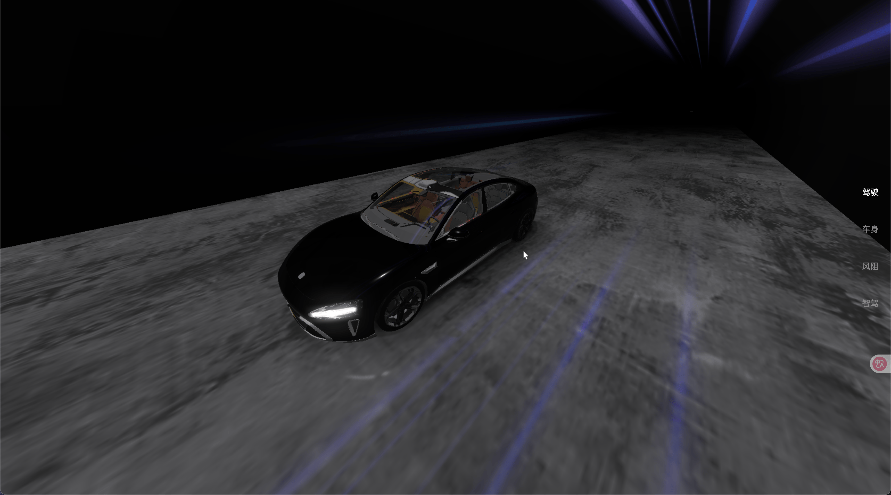
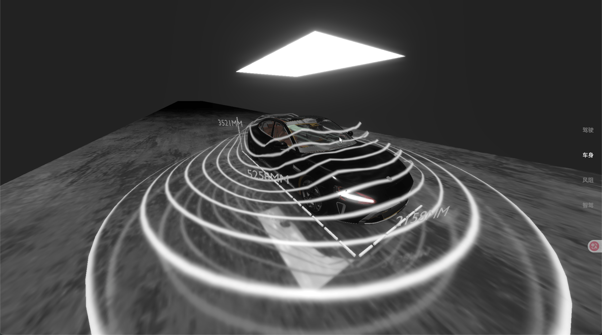
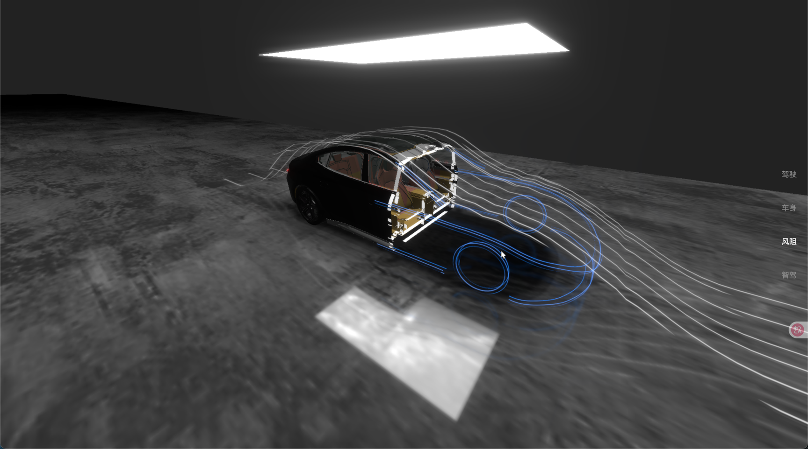
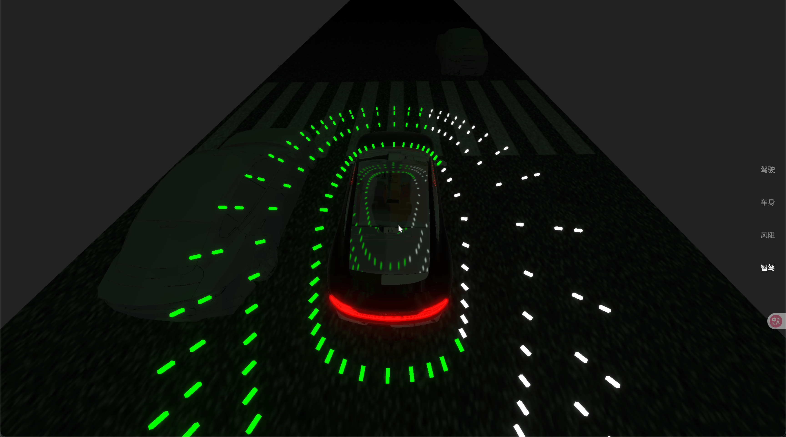

# Tailwind + React + Vite 项目

模仿gamespu 小米 SU7 项目

主要作用技术实现和功能

- 3D 模型渲染：使用 Three.js 库加载和渲染 3D 模型。
- 交互功能：实现模型的交互功能，如旋转、缩放、点击等。
- 动画效果：添加模型的动画效果，提升用户体验。
- 响应式设计：确保在不同设备上都能正常显示和操作。

## blender模型处理

## PS特效处理

## 主页预览

## 车身尺寸

## 风阻裁剪动画

## Ai 辅助驾驶

## 技术栈

- React 18
- Three.js
- Vite
- Tailwind CSS 4
- PostCSS
- Autoprefixer
